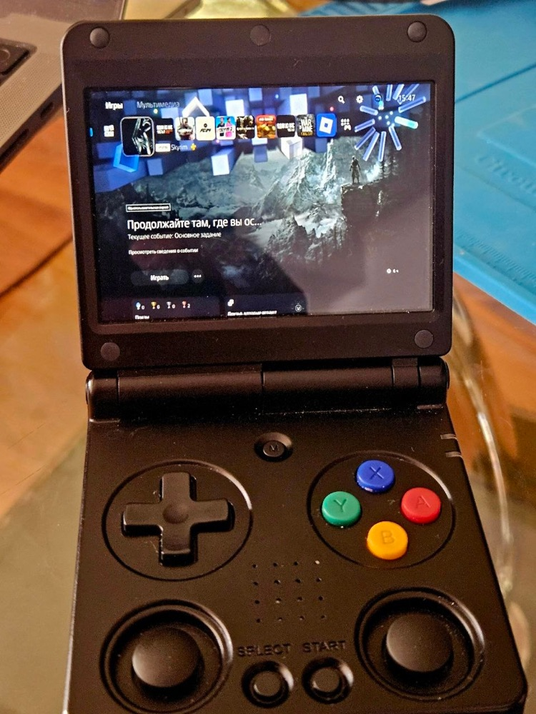
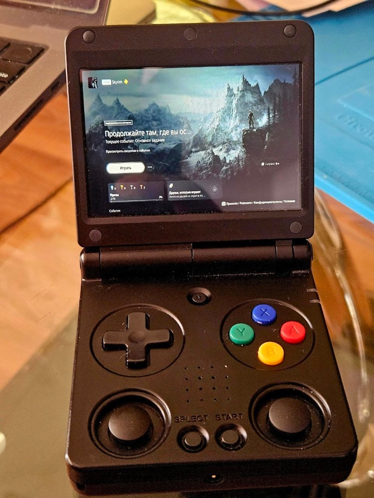
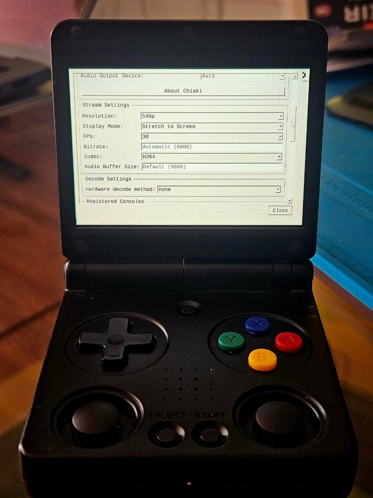
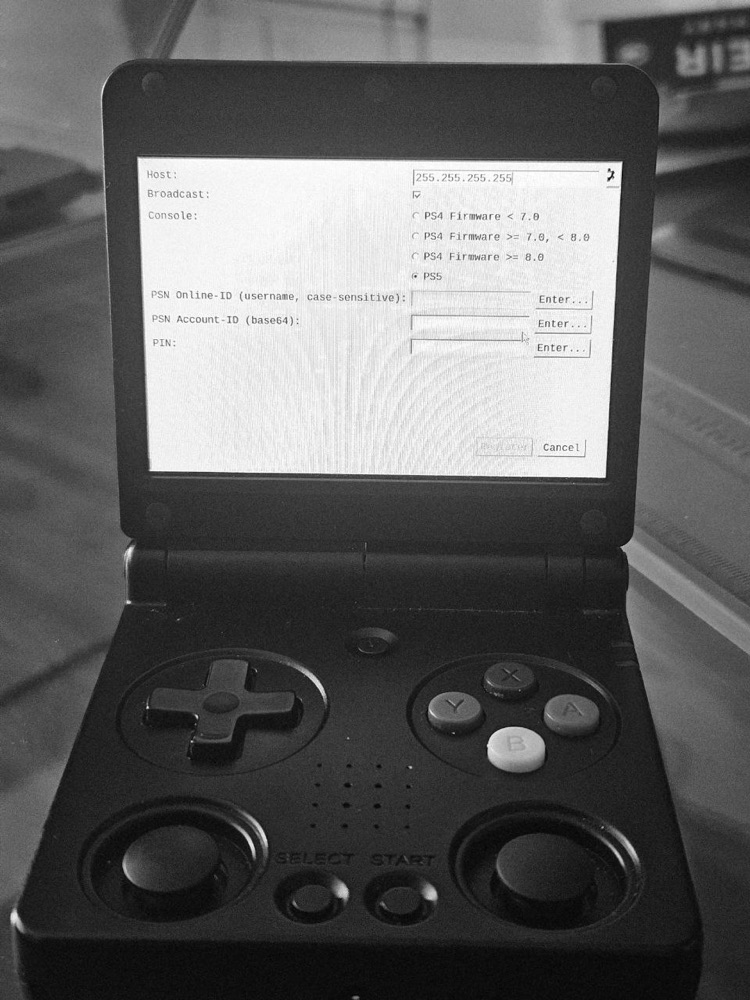
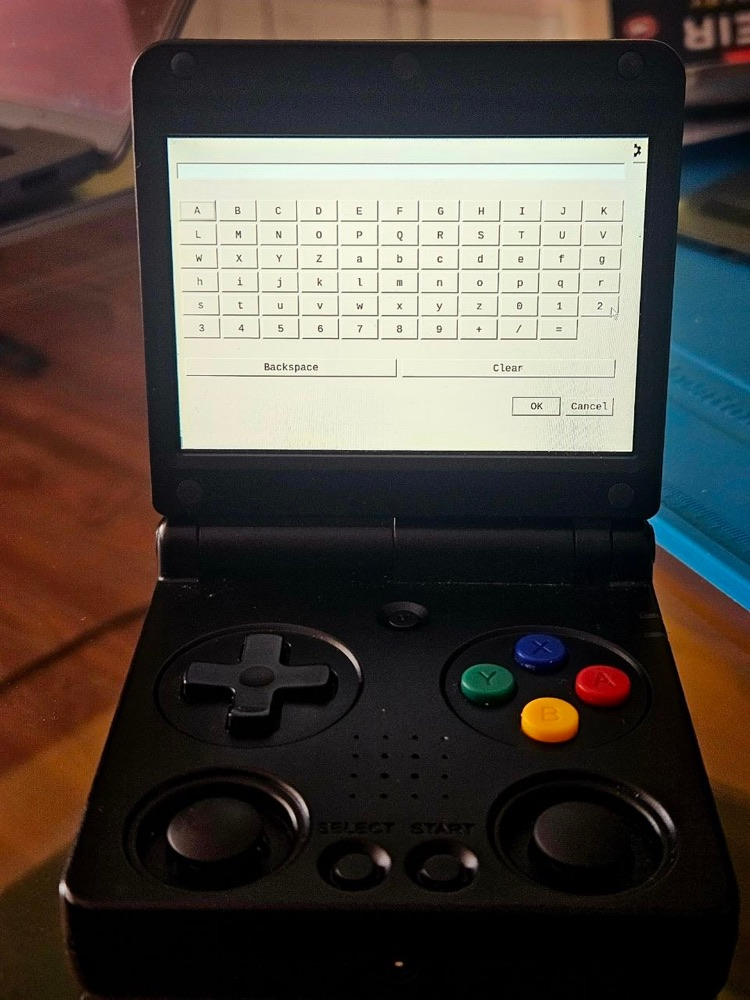

# Retro Chiaki — PS4 / PS5 Remote Play for H700 Handhelds

Retro Chiaki is a PlayStation Remote Play client for **PS4, PS4 Pro, PS5, PS5 Digital Edition and PS5 Pro**, designed for Anbernic handhelds based on the Allwinner H700. It lets you stream and control your PlayStation console over the network directly from the handheld.

It is a handheld-focused fork of [Chiaki 2.2.0](https://git.sr.ht/~thestr4ng3r/chiaki), packaged as a ready-to-use PortMaster-style port for H700 handhelds running muOS. In other words: PS4 Remote Play and PS5 Remote Play on an Anbernic Linux handheld, without needing to know what upstream Chiaki is or install desktop Linux packages.

> This project is not endorsed or certified by Sony Interactive Entertainment. You need your own PS4 or PS5 and PSN account.

  
   
  <em>PS5 Remote Play running on the Anbernic RG34XXSP.</em>

## Quick video preview

  
   
  <a href="https://www.youtube.com/shorts/PLFLnekwmY4"><strong>Watch PS5 Remote Play on the RG34XXSP →</strong></a>

## Who this is for

Retro Chiaki is intended for:

- Anbernic handhelds based on the Allwinner H700 / Mali GPU
- 720×480 and 640×480 displays
- compatible muOS installations

The currently verified configuration is:

- Anbernic RG34XXSP
- 720×480 (3:2) display
- muOS 2601 Jacaranda

Retro Chiaki now detects the framebuffer resolution when it starts and constrains its interface and stream window to the actual display. The same ARM64 build is designed to support both **720×480** and **640×480** screens; `Original` preserves the stream aspect ratio and `Stretch to Screen` fills the detected panel.

**Compatibility status:** other H700 devices and 640×480 panels are supported by the adaptive launcher and layout, but have not yet been verified on real hardware. Controller device names, firmware integration, audio and GPU libraries can differ between models, so the compatibility guarantee currently remains limited to the RG34XXSP configuration above. Please report the device model, screen resolution, firmware and results in [Issues](https://github.com/ed-fruty/retro-chiaki/issues).

**KNULLI status:** KNULLI support has not been tested yet and is not included in the current compatibility guarantee. A dedicated KNULLI build may be added later. If you try Retro Chiaki on KNULLI, please leave a report with the device and firmware version in [Issues](https://github.com/ed-fruty/retro-chiaki/issues).

## What differs from upstream Chiaki

- eglfs/Mali framebuffer support through a bundled EGL compatibility shim.
- Runtime display detection with a scrollable UI constrained to 720×480 or 640×480 screens.
- On-screen keyboard for PSN Account ID and registration PIN entry.
- Working OpenGL ES shaders and video rendering on the H700 Mali stack.
- `Original` and `Stretch to Screen` display modes.
- SDL controller mapping tailored for the known Anbernic H700/muOS input device, verified on RG34XXSP.
- Analog sticks, triggers, shoulder buttons and L3/R3 Remote Play input fixes.
- Select is mapped to the DualSense touchpad click.
- Select + Start exits the application, matching the usual muOS/PortMaster convention.
- gptokeyb is used for the connection UI and paused while streaming, preventing mouse and duplicate controller events.
- Cursor is forcibly hidden while streaming.
- Stream audio uses SDL/ALSA, which routes correctly through muOS PipeWire.
- Bundled Qt 5 runtime and dependencies: no package installation on the handheld is required.

## Controls

Before streaming, the left stick controls the mouse; D-pad and face buttons navigate the desktop-style interface. During streaming, Chiaki uses the controller directly through SDL.

| Handheld input | Remote Play action |
|---|---|
| A/B/X/Y | Cross/Circle/Square/Triangle |
| D-pad | D-pad |
| L1/R1, L2/R2 | PS shoulder buttons and triggers |
| Stick clicks | L3/R3 |
| Start | Options |
| Select | Touchpad click |
| Select + Start | Exit Retro Chiaki |

### Remote Play in action

  
   
  <em>A live PlayStation stream using the Original display mode.</em>

## Recommended stream settings

For H700 handhelds, start with this profile:

| Setting | Recommended value |
|---|---|
| Resolution | **540p** |
| FPS | **30** |
| Codec | **H.264** |
| Display Mode | **Original** for correct aspect ratio, or **Stretch to Screen** to fill the 3:2 display |

These are also the defaults for a fresh Retro Chiaki configuration. Existing Chiaki settings are preserved when upgrading.

  
   
  <em>The recommended 540p, 30 FPS and H.264 profile on the handheld.</em>

## Registration on the handheld

Console registration can be completed without a physical keyboard. Select an **Enter…** button beside the PSN Online ID, PSN Account ID or PIN field to open Retro Chiaki's controller-friendly on-screen keyboard.

| Console registration | On-screen keyboard |
|---|---|
|  |  |

## Installation

1. Download `retro-chiaki-v0.3.2-portmaster-muos-h700.zip` from [Releases](https://github.com/ed-fruty/retro-chiaki/releases/latest).
2. Extract the archive to the root of the SD card that contains your muOS `ROMS` and `ports` directories. Do not extract it inside either directory.
3. Confirm that these paths exist:
   - `ports/chiaki/chiaki`
   - `ports/chiaki/chiaki.gptk`
   - `ROMS/Ports/Chiaki.sh`
4. Refresh Ports or reboot the handheld, then launch **Chiaki** from Ports.
5. Add/register your console and start streaming.

See [the detailed installation and setup guide](docs/INSTALL.md) for SD2 setups, registration, resolution changes and troubleshooting.

### `Unknown ctrl error` when starting a stream

If Chiaki reaches the console but exits with **`Chiaki session has quit: Unknown ctrl error`**, the PlayStation Remote Play session may be temporarily busy or stuck. Session logs commonly show `InvalidSessionId`, `Ctrl did not receive session id`, or a failed Takion handshake in this situation. This can happen even when the console is registered correctly and Chiaki itself has not changed.

Wait a minute and try again. If it continues, close any other Remote Play clients, confirm Remote Play is enabled on the console, and perform a full **Restart PS4/PS5** rather than only entering Rest Mode. Reinstalling Retro Chiaki or registering the console again should not be the first troubleshooting step.

## Runtime requirements

No separately downloadable PortMaster runtime is required. The release package already bundles Qt 5, the EGLFS platform plugin, supporting Qt plugins, XKB data, the Mali EGL compatibility shim and the additional libraries needed by that Qt build.

Retro Chiaki uses the compatible SDL2, FFmpeg, OpenSSL, Opus, evdev/udev and audio libraries supplied by the tested muOS firmware. PortMaster currently supplies `gptokeyb` plus its device and exit-hotkey integration, so PortMaster must be installed before launching Retro Chiaki.

## Roadmap

- A separate native muOS Application package is planned. The launcher prototype and artwork are already kept in the repository, but no Application download is included in v0.3.2.
- KNULLI packaging and testing are planned; current releases target muOS.
- Reports from additional 720×480 and 640×480 H700 devices will be used to expand the verified compatibility list.

## Feedback

This port was developed and tested on real RG34XXSP hardware. Reports from other H700 devices are especially welcome. Please [open an issue](https://github.com/ed-fruty/retro-chiaki/issues) with:

- device model and muOS version;
- what works and what does not;
- a photo/video when the issue is visual;
- the Chiaki session log when relevant, after removing any private information.

Feature requests and control-layout suggestions are welcome too.

## Support the project

If Retro Chiaki is useful to you and you would like to support further device builds, testing and maintenance, you can leave a donation here:

Donations are optional. Bug reports, testing results and suggestions are valuable contributions too.

## Building

The ARM64 cross-build files and EGL shim source are in [`packaging/build`](packaging/build). See [BUILDING.md](docs/BUILDING.md).

## Upstream and license

Retro Chiaki is based on Chiaki by Florian Märkl and retains its GNU AGPL v3 license with the upstream OpenSSL linking exception. See [COPYING](COPYING) and [LICENSES](LICENSES). The original project and its contributors deserve credit for the Remote Play implementation; this fork focuses on retro-handheld integration and packaging.
